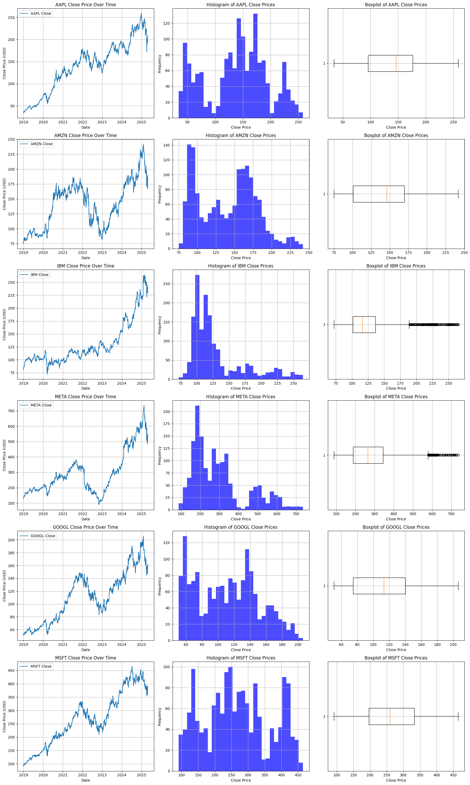
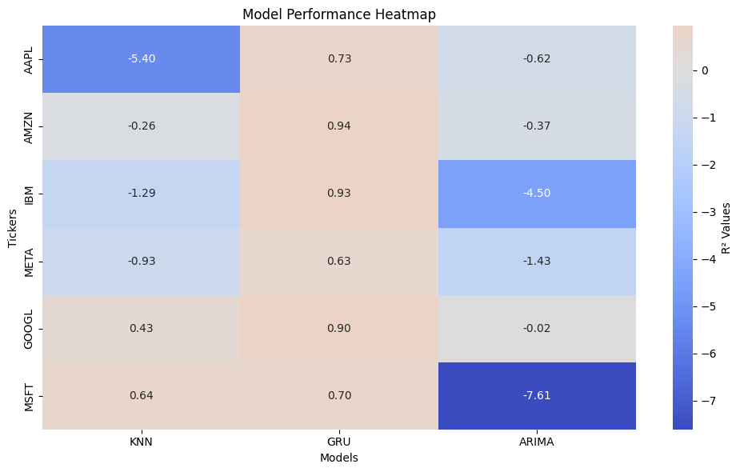

# Stock Price Forecasting: A Comparative Analysis of GRU, KNN, and ARIMA


This project explores and compares the performance of three distinct time series forecasting models—Gated Recurrent Unit (GRU), K-Nearest Neighbors (KNN) with feature engineering, and Autoregressive Integrated Moving Average (ARIMA)—for predicting daily closing stock prices.

The analysis was conducted on six major technology companies (AAPL, AMZN, IBM, META, GOOGL, MSFT) using data from January 1, 2019, to January 31, 2025. This work was originally developed as a final project for a Data Science program.


## Models & Methodology Overview

A brief overview of the approach:

1.  **Data Acquisition:** Daily closing prices sourced from Yahoo Finance via `yfinance`.
2.  **Exploratory Data Analysis (EDA):** Univariate, bivariate (ACF/PACF), and multivariate (correlation) analyses were performed to understand data characteristics. *See `Code/eda_analysis.py` for detailed EDA steps and plots.*
     <!-- Example: Show a representative univariate plot grid -->
3.  **Preprocessing:**
    *   **Scaling:** `MinMaxScaler` applied for GRU and KNN.
    *   **Sequencing:** Data transformed into lookback sequences (6 days) for GRU & KNN.
    *   **Stationarity:** ADF tests performed; differencing applied for ARIMA.
4.  **Models:**
    *   **GRU:** A TensorFlow/Keras sequential model with a GRU layer, Dropout, and Dense output layer. Trained with Adam optimizer and Early Stopping.
    *   **KNN:** Scikit-learn's `KNeighborsRegressor` with custom feature engineering (trend, volatility, momentum, SMA, RSI). Hyperparameters tuned via `GridSearchCV` (using time-series appropriate cross-validation).
        
        
    *   **ARIMA:** Statsmodels implementation with (p,d,q) order selection via AIC minimization.
5.  **Evaluation:**
    *   Primary Metric: **R-squared (R²)**.
    *   Secondary Metrics: MSE, RMSE.
    *   Statistical Significance: Diebold-Mariano tests were conducted for pairwise model comparisons.

## Key Results Summary

 <!-- Use your R² Heatmap -->

*   **GRU Dominance:** The GRU model significantly outperformed the other models, achieving an average R² of approximately **0.81**. It demonstrated robust performance across most stocks.
*   **KNN Variability:** KNN's performance was inconsistent. While it showed positive R² for MSFT (0.645) and GOOGL (0.429), it failed significantly on other stocks, resulting in an average R² of approximately **-1.13**.
*   **ARIMA Inadequacy:** Standard ARIMA models consistently performed poorly, with an average R² of around **-2.42**, indicating predictions were worse than a simple baseline.

The Diebold-Mariano tests further confirmed that GRU's forecast accuracy was statistically significantly better than both KNN and ARIMA for all six stocks examined.

## Repository Structure

*   `/Code/`:
    *   `analysis.py`: Main script for running the complete analysis pipeline (data download, EDA, model training, evaluation, plotting).

    *   `diebold_mariano_tests.py`: (separated) Script for performing Diebold-Mariano tests to see test the results of the models.
    *   `proj.ipynb`: Jupyter Notebook version with analysis and outputs.

*   `/images/`: Contains plots used in this README and potentially in the report/notebook.
*   `README.md`

## Setup & Usage

1.  **Clone the repository:**
    ```bash
    git clone https://github.com/mehrdat/data_science_project.git
    cd data_science_project
    ```
2.  **Environment Setup (Recommended: use a virtual environment):**
    ```bash
    pip install -r requirements.txt
    ```
    *(You'll need to create a `requirements.txt` file. See below.)*

3.  **Run Main Analysis:**
    ```bash
    python Code/stock_analysis.py
    ```
    This will download data (if not present), perform all analyses, generate plots, and save result files.

## `requirements.txt` File Content

Create a file named `requirements.txt` in the root of your repository with the following content (adjust versions if you used specific ones):
pandas
yfinance
matplotlib
numpy
seaborn
scikit-learn
tensorflow - keras
statsmodels
pmdarima
scipy

