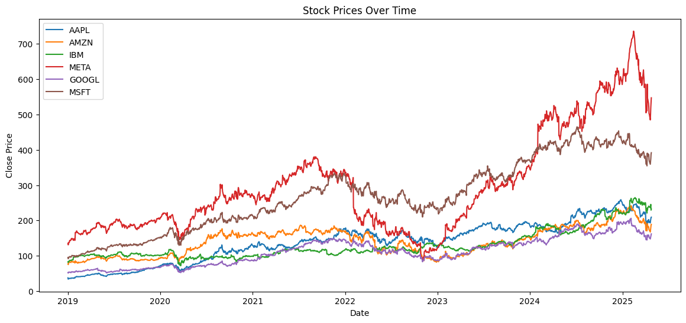

# Forecasting Stock Prices of Major Tech Companies using GRU, ARIMA, and KNN Models

 <!-- Replace with your chosen image -->
<!-- Suggestion: Upload your chosen plot to the GitHub repo and link it like: ./images/heatmap_performance.png -->

This repository contains the code and resources for the dissertation project: "Forecasting Stock Prices of 6 Tech Companies with ARIMA, KNN, and GRU," submitted in partial fulfillment of the Higher Diploma in Science in Data Analytics at Dundalk Institute of Technology.

**Author:** Mehrdad Lashgari
**Supervisor:** Dr. Abishek Kaushik
**Date:** May 2025

## Project Overview

This project conducts a comparative analysis of three distinct time series forecasting models:
*   **Gated Recurrent Unit (GRU):** A deep learning approach.
*   **K-Nearest Neighbors (KNN):** A machine learning algorithm with feature engineering.
*   **Autoregressive Integrated Moving Average (ARIMA):** A classical statistical method.

The study focuses on predicting the daily closing stock prices of six major technology companies:
*   Apple Inc. (AAPL)
*   Amazon.com Inc. (AMZN)
*   International Business Machines Corp. (IBM)
*   Meta Platforms Inc. (META)
*   Alphabet Inc. (GOOGL)
*   Microsoft Corp. (MSFT)

Data covers the period from January 1, 2019, to January 31, 2025. Models were evaluated primarily using the R-squared (R²) metric.

## Key Findings

The empirical results demonstrate a clear superiority of the **GRU model**, achieving a strong average R² of approximately 0.81 across all stocks. The **KNN model** showed inconsistent results (average R² ≈ -1.13), while the standard **ARIMA model** performed poorly (average R² ≈ -2.42), with predictions often worse than a simple baseline.

These findings suggest that deep learning models like GRU are more effective for understanding complex, non-linear financial patterns in volatile technology stocks compared to the standard KNN and ARIMA approaches evaluated.

## Repository Structure

*   `/Code/`: Contains the main Python script(s) (`stock_analysis.py`, `proj.ipynb`, `eda_analysis.py`) used for data downloading, preprocessing, exploratory data analysis, model training, evaluation, and plotting.
*   `/Data/`: Contains the dataset(s) used/generated by the project (e.g., `raw_stock_data.csv`, `results_data.csv`).
*   `/Report/`: (Optional: If you include your thesis PDF here) Contains the final dissertation report.
*   `/Presentation/`: (Optional: If you include your presentation slides here) Contains the final presentation.
*   `README.md`: This file.

## How to Use

1.  **Clone the repository:**
    ```bash
    git clone https://github.com/your_username/your_repository_name.git
    cd your_repository_name
    ```
2.  **Set up environment:**
    It is recommended to use a virtual environment. The necessary Python libraries are listed at the top of the main script(s) in the `/Code/` directory (e.g., pandas, yfinance, numpy, matplotlib, seaborn, scikit-learn, tensorflow, statsmodels, pmdarima). You can install them using pip:
    ```bash
    pip install pandas yfinance numpy matplotlib seaborn scikit-learn tensorflow statsmodels pmdarima
    ```
3.  **Run the analysis:**
    Execute the main Python script from the `/Code/` directory:
    ```bash
    python Code/stock_analysis.py
    ```
    (Adjust the script name if different). This will download data, perform EDA, train models, evaluate them, and generate plots.

## Main Artefacts

*   **Dissertation Report:** [Link to your submitted report if hosted elsewhere, or mention it's in the `/Report/` folder if included]
*   **Presentation Slides:** [Link if hosted elsewhere, or mention it's in the `/Presentation/` folder if included]

## Acknowledgement of AI Use
Generative AI tools, specifically [Insert Name of LLM Provider, e.g., ChatGPT from OpenAI], were used to assist in drafting text, refining explanations, structuring content, and suggesting code snippets during the preparation of the dissertation report and associated materials. All final content, analysis, and conclusions are the author's own work, critically reviewed and synthesized.

---

**Instructions for using the Markdown:**

1.  **Choose a Project Name:** Replace `your_repository_name` in the clone URL and potentially the main title if you pick a different name.
2.  **Image:**
    *   Save one of your key plots (e.g., the R² heatmap or the R² line plot across tickers) as an image file (e.g., `performance_summary.png`).
    *   Create an `images` folder in your GitHub repository (or just put it in the root).
    *   Upload the image to that folder.
    *   Change `link_to_your_image.png` to the actual path, e.g., `./images/performance_summary.png` or just `performance_summary.png` if it's in the root.
3.  **Update Paths/File Names:** Adjust file names in the "Repository Structure" and "How to Use" sections if yours are different (e.g., if your main script is `main.py` instead of `stock_analysis.py`).
4.  **AI Acknowledgment:** Fill in `[Insert Name of LLM Provider...]`.
5.  **Optional Links:** Decide if you want to link to your report/presentation if they are hosted online (e.g., on a university repository or Google Drive) or if you'll just include them in the GitHub repo itself.
6.  **Save:** Save this text as `README.md` in the root directory of your GitHub project.

This README provides a good overview for anyone visiting your GitHub page.